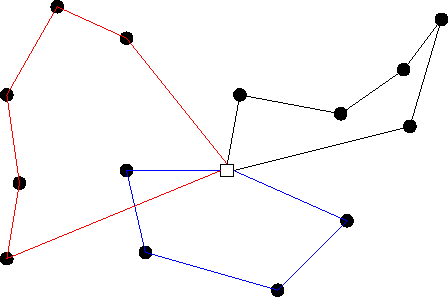
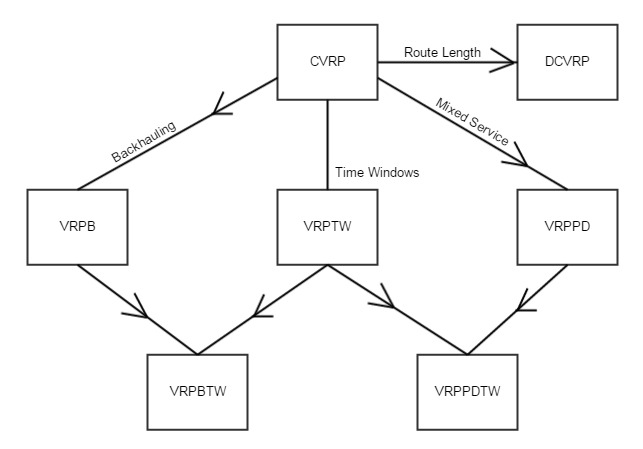
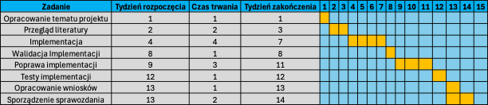
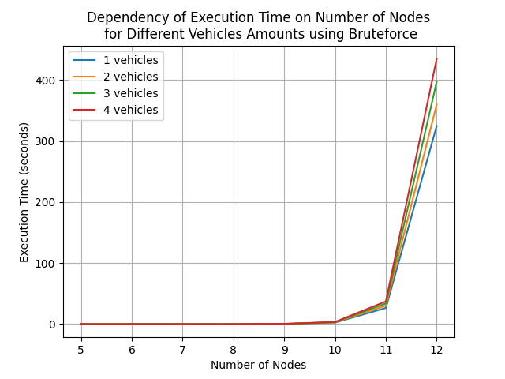

# Projektowanie i Symulacja Algorytmów

## Członkowie grupy

- Jacek Myjkowski (259062)
- Mateusz Muzioł (259223)

## Temat projektu i problem

Problemem, jakim się ten projekt będzie problem wyznaczania tras pojazdów - VRP (Vehicle Routing Problem).
Jest to jeden z przypadków rozszerzenia komiwojazera.

Problem wyznaczania tras pojazdów (VRP) polega na wyznaczeniu optymalnych tras dla floty pojazdów, które muszą dostarczyć towary do wielu miejsc, minimalizując całkowity koszt transportu. Celem jest zminimalizowanie odległości pokonanej przez wszystkie pojazdy, jednocześnie uwzględniając wybrane ograniczenia, takie jak:

- pojemnosc pojazdów \
   `Każdy pojazd ma ograniczoną pojemność, co oznacza, że może zabrać tylko określoną liczbę ładunków`
- okna czasowe \
   `Niektóre miejsca docelowe mogą wymagać dostawy w określonym przedziale czasowym`
- maksymalny czas pracy kierowców \
   `Każdy pojazd (kierowca) może mieć ograniczony czas pracy lub dzienny limit przejechanych kilometrów`
- liczba pojazdów \
   `Flota pojazdów może być ograniczona do określonej liczby, co wpływa na planowanie tras`
- koszty operacyjne \
   `Różne pojazdy mogą mieć różne koszty operacyjne, takie jak paliwo, opłaty drogowe, itp.`
- różne typy pojazdów \
   `Flota może składać się z różnych typów pojazdów, które mają różne pojemności i koszty`
- ograniczenia drogowe \
   `Niektóre drogi mogą mieć ograniczenia dotyczące wagi lub rozmiaru pojazdów`
- priorytety dostaw \
   `Niektóre dostawy mogą mieć wyższy priorytet i muszą być dostarczone wcześniej`

Jak widać ograniczeń nałozyć mozna wiele. My bazowo zdecydowaliśmy się na nałozenie limitu liczby pojazdów.

### Teoria i złozoność obliczeniowa

VRP jest problemem NP-trudnym [[1]](#1). DO jego rozwiazania najlepiej sprawdzaja się algorytmy metaheurystyczne, takie jak algorytm genetyczny, przeszukiwanie Tabu, Symulowane wyzarzanie lub ALNS (Adaptive Large Neighborhood Search). Instancję problemu mozna zwizualizować za pomoca grafu.

|  |
| :----------------------------------------------: |
|              _Graf ilustrujacy VRP_              |

VRP posiada następujace warianty:

- VRPP (Vehicle Routing Problem with Profits)
- VRPPD (Vehicle Routing Problem with Pickup and Delivery)
- VRP with LIFO
- VRPTW (Vehicle Routing Problem with Time Windows)

|      |
| :----------------------------------------------: |
| _Zwiazki pomiedzy poszczegolnymi wariantami VRP_ |

## Dane

Do implementacji algorytmów będziemy pracowac na syntetycznie generowanych grafach nie-skierowanych.

## Algorytmy

Planowo zestawimy ze sobą trzy algorytmy, przy czym skupimy się na tym najbardziej skomplikowanym - genetycznym. Postaramy się dokonac jego fine-tuningu aby działał efektywnie i skutecznie.

### Przegląd zupełny

Mozliwy do zastosowania dla małej liczby celów. Polega na przejrzeniu wszystkich dostępnych opcji. Daje gwarancję znalezienia najlepszego rozwiązania przy bardzo duzym koszcie obliczeniowym.

### Losowy

Nie daje nam gwarancji znalezienia optymalnego rozwiązania, za to działa szybko i przyjemnie dla dowolnego rozmiaru zbioru wierzchołków.

### Genetyczny

Reprezentacja chromosomu: \
`Każdy chromosom reprezentuje możliwe przypisanie klientów do tras pojazdów (kolejność odwiedzanych miejsc).` \
Ocena fitness: \
`Funkcja oceny może obejmować całkowitą pokonaną odległość, czas dostawy, koszty paliwa, liczbę pojazdów użytych itp.`\
Krzyżowanie i mutacja: \
`Tworzenie nowych rozwiązań poprzez wymianę części tras między pojazdami lub wprowadzanie drobnych zmian w kolejności obsługi klientów.` \
Selekcja: \
`Najlepsze trasy przechodzą do kolejnych iteracji, co zbliża algorytm do optymalnych rozwiązań.`\

## Wykres Gantta

|                          |
| :------------------------------------------------------------: |
| _Wykres Gantta przedstawiajacy harmonogram prac nad projektem_ |

## Przygotowanie środowiska pracy

### Wymagania

- python

### Środowisko wirtualne

#### Instalacja i aktywacja

```bash
python3 -m venv venv
source venv/bin/activate
python -m pip install -r requirements.txt
```

#### Deaktywacja środowiska

```bash
deactivate
```

## Przechowywanie wyników
Wyniki działania algorytmu zapisywane są w folderze `results` w formacie JSON:
```json
[
   {
      "name":"<FILENAME>",
      "nodes_count": "<NODES_IN_GRAPH>",
      "edges_count": "<EDGES_IN_GRAPH>",
      "vehicles_amounts": [
         {
            "vehicles_amount": "<AMOUNT_OF_VEHICLES>",
            "execution_time": "<EXECUTION_TIME>",
            "best_routes": [
               [
                  "<LIST_OF_NODES_FOR VEHICLE_1>"
               ],
               [
                  "<LIST_OF_NODES_FOR_VEHICLE_2>"
               ], [...]
         }, {...}
      ]
   },
   {...}, ...
]
```
Kazda sciezka zaczyna się i kończy w wierzchołku A, który uznawany jest za bazę

## Reprezentacja wyników
### Przegląd zupełny
Na ponizszym wykresie pokazane zostało porównanie czasu działania algorytmu dla róznych konfiguracji parametrów wejściowych, takich jak:
- ilośc pojazdów
- ilośc wierzchołków w grafie

|                          |
| :------------------------------------------------------------: |
| _Wykres przedstawiający zaleznośc czasu wykonania algorytmu od ilości wierzchołków w grafie_ |

## Literatura

<a id="1">[1]</a>
Claudia Archetti, Dominique Feillet, Michel Gendreau, M. Grazia Speranza,
Complexity of the VRP and SDVRP,
Transportation Research Part C: Emerging Technologies,
Volume 19, Issue 5,
2011,
Pages 741-750,
ISSN 0968-090X,

<a id="2">[2]</a>
Kris Braekers, Katrien Ramaekers, Inneke Van Nieuwenhuyse,
The vehicle routing problem: State of the art classification and review,
Computers & Industrial Engineering,
Volume 99,
2016,
Pages 300-313,
ISSN 0360-8352

<a id="3">[3]</a>
Wikipedia contributors.
"Vehicle routing problem."
Wikipedia, The Free Encyclopedia. Wikipedia, The Free Encyclopedia,
3 Oct. 2024.
Web. 12 Nov. 2024.

<a id="4">[4]</a>
Bruno Scalia C. F. Leite.
"The Vehicle Routing Problem: Exact and Heuristic Solutions"
Medium, Towards Data Science
4 Aug. 2023.
Web. 12 Nov. 2024.
